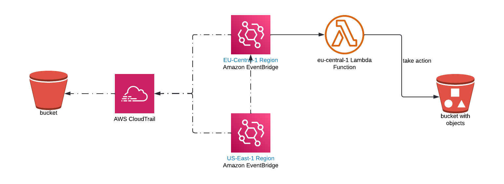

# lambda world

- An event rule is triggered when a new bucket is created.
- If the bucket is created in other region the bucket will be deleted, except in 'eu-central-1'
- With the help of custom cloud-trail, the eventbrige rule triggers lambda fn. Then lambda will check for list of bucket in all regions.
- If the lambda finds the bucket other than eu-central-1 region. It will deleted immediately.

> Note: The previous resources won't be deleted along with version files.

## Eventbrige rule

An eventbrige rule is required for every region. This will trigger lambda fn in 'eu-central-1'. This lambda has power to delete s3-buckets.

## design


## To bootstrap AWS CDK in all regions

create a file, bootstrap.sh, execute sh bootstrap.sh
or
```
sh bootstrap.sh 61983122xxxx
```
```
#!/bin/bash

# Get the list of all available regions
regions=$(aws ec2 describe-regions --query "Regions[].{Name:RegionName}" --output text)

# Run cdk bootstrap for each region
for region in $regions
do
  npx cdk bootstrap aws://ACCOUNT_ID/$region
done
```

> **Note:** pass account id for *ACCOUNT_ID*

